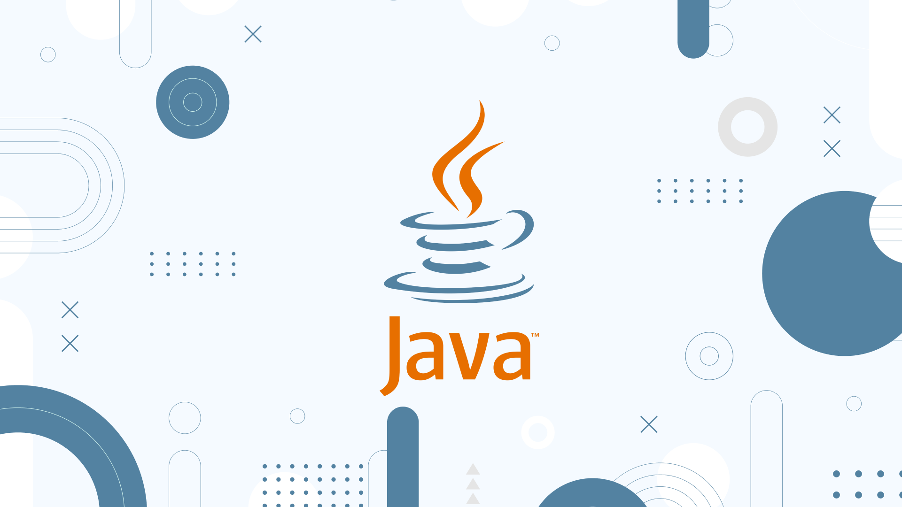
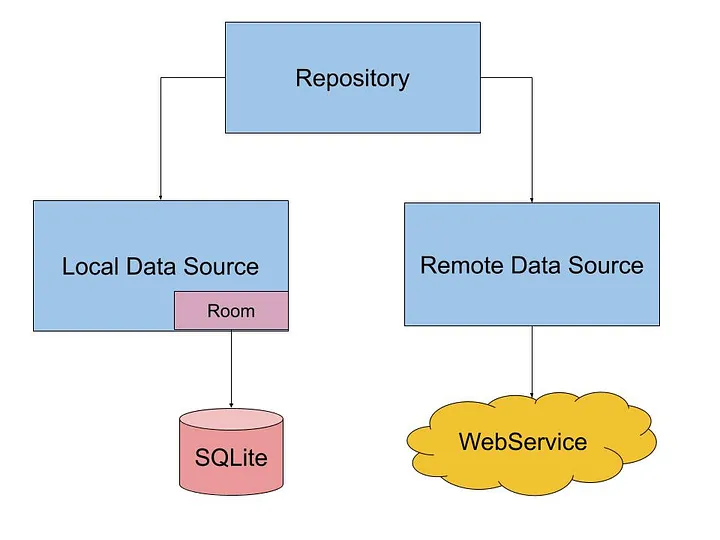

# Kotlin Local and Remote



## Acerca de

Este proyecto es un ejemplo de como crear un servicio para el almacenamiento de datos Java.

Tendremos un repositorio local usando una base de datos, y un repositorio remoto utilizando una API REST.

Ambos repositorios estarán encapsulados en un solo servicio, que será el que utilicemos en nuestra aplicación.
Es decir, cada cierto tiempo se actualizará la base de datos local con los datos de la API REST. Otro caso de uso es que
no haya conexión, o simplemente
queramos trabajar con los datos locales o si no se encuentran actualizados, con los datos de la API REST.
Además, otra caché en memoria se encargará de almacenar los últimos datos obtenidos de la base de datos local o de la
API REST para mejorar el rendimiento de la aplicación. Es decir, si la base de datos local no está actualizada, se
obtendrán los datos de la API REST cada cierto intervalo de refresco y se almacenarán en la base de datos local. En la
caché
en memoria se almacenarán los últimos datos obtenidos de la base de datos local o de la API REST.

El intervalo de refresco de la base de datos local y el de la caché en memoria se puede configurar.

Por otro lado, el servicio podrá importar/exportar datos en CSV y JSON.

Finalmente, tendremos un servicio de notificaciones, que nos permitirá recibir información de los cambios realizados.

El objetivo docente es mostrar implementaciones asíncronas y reactiva en el procesamiento de la información.

Puedes seguir el proyecto en [GitHub](https://github.com/joseluisgs/JavaLocalAndRemote) y en los commits indicados.

```
El proyecto está sobre-exagerado para mostrar diferentes técnicas y no es un ejemplo de cómo hacer una aplicación real.
Se trata de elementos aislados que se pueden utilizar en una aplicación real con el objetivo que el alumnado identifique
y asimile nuevas técnicas y herramientas de programación. No tiene que ser la mejor forma ni la más eficiente, pero sí
intenta acercar otras formas de programar nuevas que se están viendo en clase. El objetivo es aprender y no hacer una
aplicación real y eficiente. 
```

La idea subyacente es el famoso patrón de diseño Repository usado en Android, pero llevado a un nivel superior.



## Programación asíncrona y reactiva

La
programación [asíncrona](https://sunscrapers.com/blog/programming-async-vs-sync-best-approach/)
es un modelo de programación que permite realizar tareas en segundo plano sin bloquear el hilo
principal de
la aplicación.
La [reactividad](https://www.baeldung.com/cs/reactive-programming#:~:text=Reactive%20programming%20is%20a%20declarative,or%20reactive%20systems%20in%20general.)
es un modelo de programación que permite reaccionar a eventos de forma rápida y eficiente.
La programación reactiva es un paradigma de programación declarativa que se basa en la idea del procesamiento asíncrono
de eventos y flujos de datos.

En Java, la programación asíncrona y reactiva se puede realizar
con [RxJava](https://github.com/ReactiveX/RxJava)
y [Project Reactor](https://projectreactor.io/).

Con Project Reactor usaremos los conceptos de Flux y Mono:

- [Flux](https://projectreactor.io/docs/core/release/api/reactor/core/publisher/Flux.html): representa un flujo de
  datos asíncrono y reactiva que puede emitir cero o más elementos.
- [Mono](https://projectreactor.io/docs/core/release/api/reactor/core/publisher/Mono.html): representa un flujo de
  datos asíncrono y reactiva que puede emitir cero o un elemento.

De esta manera, podemos realizar operaciones asíncronas y reactivas de forma sencilla y eficiente.

En Java podemos hacer uso de CompletableFuture para la asincronía. CompletableFuture es una clase que nos permite
realizar
operaciones asíncronas que requieren un resultado y es parte de los Futures de Java.

Project Reactor nos permite trabajar con programación reactiva y asíncrona con dos elementos importantes Mono y Flux.
Mono nos puede hacer las veces de CompletableFuture y Flux nos permite trabajar con secuencias de valores.

- Usa Project Reactor cuando trabajes con una secuencia de valores que necesitan ser emitidos y procesados con
  operadores
  reactivos.
- Usa CompletableFuture cuando tengas tareas asíncronas discretas que necesiten ejecutarse de manera concurrente y
  combinadas
  al
  final.

En muchas partes de este código nos decantaremos por ProjectReactor para darle un enfoque más reactivo aunque esto
suponga
sobrecarga innecesaria. Recuerda que es educativo y es para que tú practiques cosas nuevas.

## Railway Oriented Programming

El [Railway Oriented Programming](https://fsharpforfunandprofit.com/rop/) (ROP) es un estilo de programación que se basa
en el uso de funciones que devuelven un
resultado. De esta manera, se pueden encadenar operaciones de forma sencilla y eficiente. En Java, el ROP se puede
realizar con la clase [Either](https://www.baeldung.com/vavr-either). La clase Result es una clase que representa un
resultado exitoso o un resultado fallido.
De
esta manera, se pueden realizar operaciones de forma sencilla y eficiente.

Para ello debemos entender que es el Happy Path y el Error Path. El Happy Path es el camino feliz, es decir, el camino
que se espera que se siga. El Error Path es el camino de error, es decir, el camino que se sigue cuando se produce un
error.

De esta manera podemos encadenar operaciones de forma sencilla y eficiente. Si una operación falla, se sigue el Error
Path. Si una operación tiene éxito, se sigue el Happy Path.

## Almacenamiento y Serialización

El primer paso es crear un servicio de almacenamiento y serialización de datos para realizar las operaciones de lectura
y escritura de datos. Para ello, crearemos una interfaz `StorageService` que definirá las operaciones de lectura y
escritura.

Luego, crearemos una implementación de esta interfaz para almacenar los datos en formatos CSV y JSON.
Para facilitar la serialización y deserialización de los datos en Json
usaremos [`Jackson`](https://www.baeldung.com/jackson).

Haremos uso de mapeadores para convertir los datos de un formato a otro.

En todo momento trabajaremos la asincronía y la reactividad mediante ROP en la lectura y escritura de datos con Mono y
Either.

Enlace a
los [commit de la sección](https://github.com/joseluisgs/JavaLocalAndRemote/tree/f600e010270c47606abad7f9b7ccf8b72a0b39d4).

## Cache en Memoria

Para realizar la caché en memoria, crearemos una interfaz genérica `Cache` que definirá las operaciones de lectura y
escritura de datos.

Ene ste momento tenemos dos alternativas: FIFO y LRU.

- FIFO: First In First Out, es decir, el primer elemento que entra es el primero en salir. Como ventajas es más sencillo
  de implementar, no necesita de un contador de accesos ni de un contador de tiempo. Como desventajas no tiene en cuenta
  la frecuencia de uso de los elementos, ni el tiempo de uso de los elementos, ni la importancia de los elementos.
- LRU: Least Recently Used, es decir, el elemento menos recientemente usado es el primero en salir. Como ventajas tiene
  en cuenta la frecuencia de uso de los elementos, el tiempo de uso de los elementos y la importancia de los elementos.
  Como desventajas es más complejo de implementar, necesita de un contador de accesos y de un contador de tiempo.

Para la implementación de la caché en memoria con LRU usaremos un truco si conoces bien las colecciones
como `LinkedHashMap` que nos permite
ordenar los elementos por el orden de inserción. De esta forma, el primer elemento que se inserta es el primero en
salir. Si usamos
un `LinkedHashMap` con `accessOrder` a `true`, los elementos se ordenarán por el orden de acceso, es decir, el último
elemento accedido
será el último en salir. Además, si implementamos un `removeEldestEntry` podemos controlar el tamaño de la caché y
eliminar el elemento menos
recientemente usado.

Enlace a
los [commit de la sección](https://github.com/joseluisgs/JavaLocalAndRemote/tree/bc281698c58a160279ef5c4c4f0da3070ecb9e2e).

## Repositorio Local

Para la realización del repositorio local, hemos usado SQLite [JDBI](https://jdbi.org/),
una librería que nos permite definir las
tablas y las consultas de una manera muy sencilla, de hecho hemos usado SQLite con su version SqlObject, obteniendo el
DAO

Para la implementación del repositorio local, hemos creado una interfaz `Repository` que define las operaciones de
lectura y escritura de datos. Seguimos usando asincronía con Flux y trabajando ROP con Either.

De esta manera hemos podido separar la lógica de la base de datos de la lógica de la aplicación.

Enlace a
los [commit de la sección](https://github.com/joseluisgs/JavaLocalAndRemote/tree/7739f4fa3b755260afd762996cf2e68ddccdd231).

## Repositorio Remoto

Para la realización del repositorio remoto, hemos usado [Retrofit](https://square.github.io/retrofit/), una librería que
nos
permite realizar peticiones a
una API REST de forma sencilla y eficiente. Además le hemos añadido las opciones para parsear los datos con Jackson y el
manejo de Mono y Flux.

Para ello, hemos creado una interfaz para definir las operaciones de la API REST y una implementación de un repositorio
donde
usando RetroFit realizamos las peticiones a la API REST.

Una de las ventajas de Retrofit es que nos permite definir las operaciones de la API REST de forma sencilla y eficiente
de manera asíncrona gracias a Project Reactor.
Enlace a
los [commit de la sección](https://github.com/joseluisgs/JavaLocalAndRemote/tree/7c3b8a43b1d8dc7dda3be46a11e908f50a174947).

## Validador

Para la realización del validador de datos, hemos usado una clase que nos permite validar los
datos de forma sencilla y eficiente.

Enlace a
los [commit de la sección](https://github.com/joseluisgs/JavaLocalAndRemote/tree/e3a56344d3d2d92ab909a5b8e0e628fe1aea834d).

## Notificaciones

Para la realización del servicio de notificaciones, hemos hecho uso de dos clases de la familia de los Flux de Project
Reactor que nos
pueden ayudar a ello:

- `Sinks.Many` de Project Reactor para gestionar las notificaciones. Sinks es una clase que proporciona una manera de
  crear componentes reactivos que puedan actuar como "agujeros" para recibir eventos y también como "fuentes" para
  emitir eventos a los suscriptores. En este caso, se utiliza Sinks.Many para crear una canal de comunicación que puede
  emitir múltiples eventos a múltiples suscriptores.
- `Flux` para gestionar las notificaciones. Flux es una clase que representa un flujo de datos asíncrono y reactiva que
  puede emitir cero o más elementos. En este caso, se utiliza Flux para gestionar las notificaciones de forma asíncrona
  y reactiva.

Al utilizar `replay()` se crea un Sink que puede publicar valores a múltiples suscriptores, y reenvía (replays) los
valores emitidos a cualquier nuevo suscriptor.
En contraste con otros tipos de sinks (`unicast`, `multicast`), un replay sink permite que cualquier nuevo suscriptor
reciba
todos los valores anteriores emitidos por el sink.

`limit(1)`: Limita la capacidad de retención de elementos a 1. Esto significa que el sink solo almacenará el último
elemento emitido, y cualquier nuevo valor que llegue hará que se reemplace el anterior.
Esta combinación es útil cuando solo quieres que los suscriptores reciban el valor más reciente emitido por el sink.

`asFlux()` devuelve un Flux que se suscribe a los eventos emitidos por el sink. Esto permite que los suscriptores
reciban y procesen los eventos emitidos por el sink.

`onBackpressureDrop()` descarta los eventos si los suscriptores no pueden consumirlos de inmediato

El método tryEmitNext(notification) se utiliza para intentar enviar una notificación a los suscriptores. Si los
suscriptores están listos para procesar la notificación, esta se envía inmediatamente. Por otro lado, si los
suscriptores no están listos o hay un desbordamiento de buffer, el método puede actuar según la política de backpressure
especificada, en este caso, probablemente descartando eventos antiguos (onBackpressureDrop) cuando el buffer está lleno.

Recuerda que en project reactor un `Flux` es un cold stream, es decir, no se emite nada hasta que alguien se suscribe a
él
y
Y siempre emite los eventos desde el principio. Si necesitas un hot stream, es decir, que emita eventos aunque no haya
suscriptores, puedes usar un `ConnectableFlux` o un `Sinks.Many.replay()`.

En resumen, esta implementación con Sinks.Many y Flux en Project Reactor permite la creación de un estado compartido
para las notificaciones, donde se puede enviar múltiples notificaciones y los suscriptores recibirán y procesarán solo
la última notificación cuando se suscriban, evitando así la acumulación de notificaciones o la pérdida de eventos. El
uso de políticas de backpressure como onBackpressureBuffer y onBackpressureDrop ayuda a gestionar de manera eficiente la
producción y el consumo de eventos en situaciones donde el flujo de eventos puede ser variable o pesado.

Enlace a
los [commit de la sección](https://github.com/joseluisgs/JavaLocalAndRemote/tree/4920a4a69229f1039c2c121b53147c60e70377f5).

## Servicio

El siguiente paso es crear un servicio que encapsule los repositorios local y remoto y la caché en memoria. Para ello,
crearemos una interfaz `Service` que definirá las operaciones de lectura y escritura de datos.

De esta manera, podremos utilizar el servicio en nuestra aplicación para almacenar y recuperar los datos de forma
sencilla y eficiente.

Enlace a
los [commit de la sección](https://github.com/joseluisgs/JavaLocalAndRemote/tree/a302db698e5939955418267707e9533498ee424f).

## Tests

A la hora de realizar los tests, hemos usado [Mockito](https://site.mockito.org/) para simular los objetos y las
operaciones de
forma sencilla y eficiente. Nos permite crear mocks de forma sencilla.
De esta manera, hemos podido realizar los tests creando los dobles de las dependencias y simulando las operaciones
necesarias.

Para el testeo de Flux y Mono hemos usado en el caso que sea
necesario [StepVerifier](https://github.com/joseluisgs/JavaLocalAndRemote/tree/0e010f1c452492e1bbd902aa22bf2353e4c1e41d),
puedes verlo en el método `refresh()`del servicio.

Enlace a
los [commit de la sección](https://github.com/joseluisgs/KotlinLocalAndRemote/tree/1512d25e017d8c6e5a0224641ade634efe1411b4).

## Inyección de Dependencias

Para la inyección de dependencias hemos usado [Dagger](https://dagger.dev/), una librería que nos permite inyectar
dependencias de forma sencilla y eficiente. Nos permite definir los módulos y las dependencias existentes, ya sea manual
o con anotaciones.
Además, nos permite inyectar propiedades desde un archivo de propiedades.

Hay que tener en cuenta que Dagger se resuleve en tiempo de compilación, por lo que se debe hacer un rebuild del
proyecto
para que se apliquen los cambios y se generen las clases necesarias.

Enlace a
los [commit de la sección](https://github.com/joseluisgs/JavaLocalAndRemote/tree/ab6bea2d607d637566a7f3e59ef16cdc61482e6b).